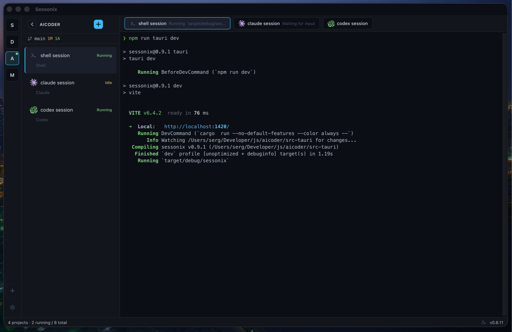

# Sessonix

**Agent Mission Control** — run Claude Code, Codex CLI, Gemini CLI and any other AI agents in parallel from a single window.

No more tab juggling. One dashboard, all your agents, every project.




## Why Sessonix

You're running three Claude Code sessions, a Codex task, and a Gemini experiment — each in its own terminal window. You can't tell which one is thinking, which one is stuck, and which one finished five minutes ago.

Sessonix puts them all on one screen. You see the live status of every agent at a glance, switch between sessions instantly, and never lose terminal output when you look away.

## Key Features

### Run Multiple Agents Side by Side

Launch Claude Code, Codex CLI, Gemini CLI, or any custom command — all from a unified session launcher. Each session runs in a real PTY terminal with full color and interactivity.

### See What Every Agent Is Doing

Live status badges show the current state of each session — Thinking, Reading, Writing, Idle, or Error — without switching to it. For Claude, optional hooks provide instant status updates.

### Group Sessions into Tasks

Create a Task — give it a name, get a git worktree on its own branch — then launch multiple agent and shell sessions inside it. A Claude session to write the code, a shell to run tests, a Codex session for a second opinion. All three share the same worktree, all three live under the same Task in the sidebar, collapsed into a neat group.

Branch names are auto-generated from the task name as you type (`Fix auth flow` → `feat/fix-auth-flow`), with transliteration for Cyrillic, Ukrainian, and accented Latin input. Delete the task and Sessonix kills every session inside, removes the worktree, and cleans up the database in one atomic step.

### Git Worktrees Built In

Tick a checkbox to launch a single session in an isolated git worktree — the agent works on its own branch in its own directory, and Sessonix cleans up when you're done. For multi-session workflows, wrap the worktree in a Task (above).

### Switch Instantly, Lose Nothing

Flip between sessions with `Cmd+1-9`. A ring buffer captures all output while you're away, so you see every line the agent produced — even if you weren't watching.

### Organize by Project

Group sessions by project directory. The entire UI scopes to the active project — sidebar, session tabs, keyboard shortcuts. Switch projects in one click.

### Survives Restarts

Projects, sessions, tasks, active selection, and terminal scrollback are persisted to a local database. Relaunch the app and pick up exactly where you left off.

### Git Status at a Glance

Current branch, modified/added/deleted file counts — always visible in the status bar. Worktree sessions are clearly marked.

### Keyboard-First Workflow

| Shortcut | Action |
|----------|--------|
| `⌘⇧T` | New session |
| `⌘⇧W` | Kill session |
| `⌘⇧K` | Add project |
| `⌘1-9` | Switch to session 1–9 |

### Native Desktop Experience

OS notifications, native folder picker, drag-to-reorder sessions, and a welcome wizard that detects which agents you have installed.

## Getting Started

### macOS (Homebrew)

```bash
brew tap Pentium133/sessonix
brew install --cask sessonix
```

To update: `brew upgrade sessonix`

### Manual install

1. Download the latest release for your platform
2. Install and open Sessonix — the welcome wizard will detect installed agents
3. Add a project directory
4. Launch your first session

> **macOS note:** The app is not signed with an Apple Developer certificate. If installing manually, remove the quarantine attribute:
> ```bash
> xattr -rd com.apple.quarantine /Applications/Sessonix.app
> ```

## Built With

Rust + Tauri 2 backend, React + TypeScript frontend, xterm.js terminals. Tokyo Night theme.

## Development

```bash
npm install
npm run tauri dev     # full app with hot reload
npm run tauri build   # production build
```

See [CLAUDE.md](CLAUDE.md) for architecture details and developer guide.

## License

MIT
